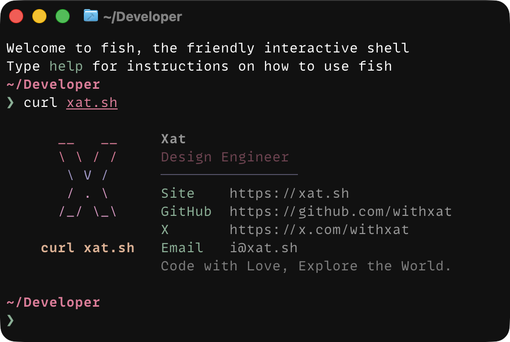

# Card

A command-line business card for your domain.

```sh
curl xat.sh
```

Card lets a domain greet terminal users with a neofetch-style profile while the
same domain keeps working as a normal website in browsers.

## What It Feels Like

<p>
  
</p>

The output includes ANSI color in terminals that support it.

## Features

- **One domain, two experiences**: `curl xat.sh` shows a terminal card; browser
  visits continue to load the original site.
- **Root-only routing**: attach the Worker to the apex route pattern so existing
  pages and assets stay out of the blast radius.
- **CLI-aware response**: curl, wget, HTTPie, xh, aria2, Python Requests, Go's
  HTTP client, and libwww-perl are recognized by user agent.
- **Neofetch-style output**: styled plain text with ANSI colors, safe for normal
  terminals and easy to customize.
- **Origin passthrough**: browser traffic and non-root paths are forwarded with
  `fetch(request)`.
- **Browser-only HTTPS redirect**: plain `curl xat.sh` can work while browsers
  still get redirected from HTTP to HTTPS.

## How It Works

Card is a Cloudflare Worker. It sits at the root of a proxied Cloudflare zone:

```txt
curl xat.sh  ->  Cloudflare Worker  ->  terminal card
browser      ->  Cloudflare Worker  ->  original website
```

The Worker only needs to see the apex root route. For this project that route is:

```txt
xat.sh
```

That means paths such as `/about`, `/blog`, and `/assets/app.js` keep behaving
like the original website.

## Try It Locally

```sh
pnpm install
pnpm --filter @withxat/card-worker run dev
```

In another terminal:

```sh
curl localhost:8787
```

## Worker Guide

The full setup lives in [`apps/worker/README.md`](apps/worker/README.md):

- local development;
- build and test commands;
- Wrangler deploy flow;
- Cloudflare DNS and route requirements;
- `BROWSER_HTTPS_REDIRECT`;
- custom card text and ANSI styling.

## Project Structure

```txt
apps/worker/       Cloudflare Worker implementation
packages/ui/       Shared React component library retained from the workspace
```

## Scripts

| Command          | Description                    |
| ---------------- | ------------------------------ |
| `pnpm build`     | Build all packages             |
| `pnpm test`      | Run tests                      |
| `pnpm typecheck` | Type-check all packages        |
| `pnpm lint`      | Lint all packages              |
| `pnpm lint:fix`  | Lint and auto-fix all packages |

## License

[MIT](LICENSE)

## Author

**Card** © [Xat](https://github.com/withxat), Released under the
[MIT](https://github.com/withxat/Card/blob/main/LICENSE) License.

> [Blog](https://xat.sh) · GitHub [@withxat](https://github.com/withxat) ·
> Telegram [@withxat](https://t.me/withxat) · X
> [@withxat](https://x.com/withxat) · Email [i@xat.sh](mailto:i@xat.sh)
